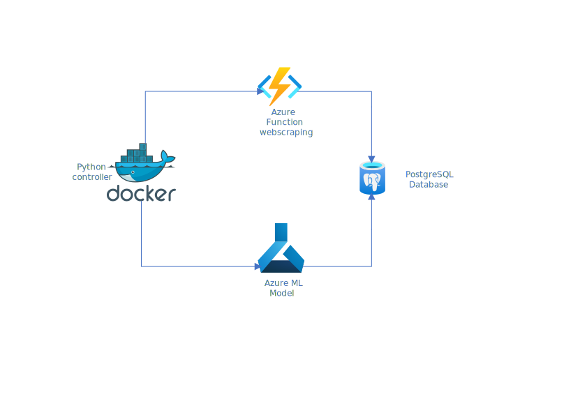

# MS_AZURE_AI_WEB_SCRAPING
## Opis projektu i funkcjonalności
### Opis projektu
Projekt polega na napisaniu algorytmu, identyfikującego elementy interaktywne dowolnie wybranej strony internetowej oraz zaimplementowaniu go w technologii udostępnionej przez Microsoft Azure. Finalnym efektem projektu powinny być:
* Odpowiednio spreparowany zestaw danych treningowych umożliwiających utworzenie modelu wykorzystywanego przez algorytm.
* Gotowy wytrenowany model.
* Algorytm w formie reużywalnego kodu napisanego w języku Python.

Dodatkowo algorytm zostanie poddany testowi na wybranym przez klienta sklepie internetowym w celu weryfikacji jego poprawnego działania. Opracowanie sposobu pozyskania danych do utworzenia modelu oraz testowania algorytmu zostanie wykonane z pomocą klienta.

### Wymagania projeku
#### Wymagania funkcjonalne
* System będzie pozyskiwać dane za pomocą web scrapingu, następnie będzie je przetwarzać oraz zapisywać otrzymane wyniki w bazie danych.
* System będzie w stanie spreparować pozyskane dane do zastosowania przy uczeniu modelu.
* System będzie mógł utworzyć określony model oraz wytrenować go za pomocą danych wejściowych podanych przez użytkownika.
* System będzie pobierać adres strony internetowej oraz odpowiedni model, a następnie zwracać interaktywne elementy z danej strony w określonej przez klienta formie.

#### Wymagania niefunkcjonalne
* System będzie działać na platformie MS Azure.
* System będzie oparty na języku Python.
* System będzie w stanie przetworzyć dowolną stronę internetową.

## Diagram

## Stos technologiczny

### Web scraping
* Azure Functions
* Python - request i BeautifulSoup
### Machine Learning
* Azure Machine Learning Service
* Python - pandas, numPy, sklearn, seaborn
### Baza danych
* Azure Database for PostgreSQL

## Harmonogram

### P3: (10.12)  

* Wstępny research  
* Przygotowanie listy pytań dla PO    
* Przygotowanie zbioru danych uczących  

### P4: (7.01) 

* Zaimplemetowanie kodu lokalnie
* Uruchomienie testowej aplikacji na Azure

### P5: (14.01) 

* Testowanie aplikacji (ewentualne poprawki)  
* Zaplanowanie wdrożenia  

### P6: (21.01)  

* Wdrożenie aplikacji na Azure oraz przetestowanie w nowym środowisku

### P7: (28.01)  

* Prezentacja projektu
